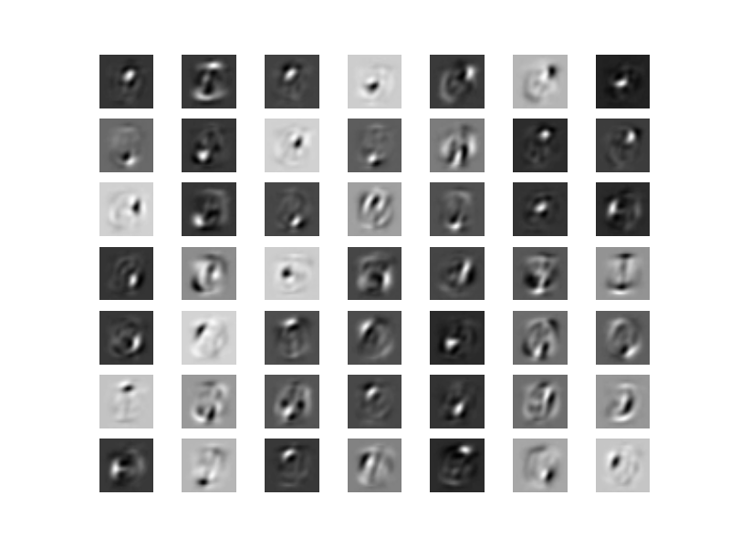
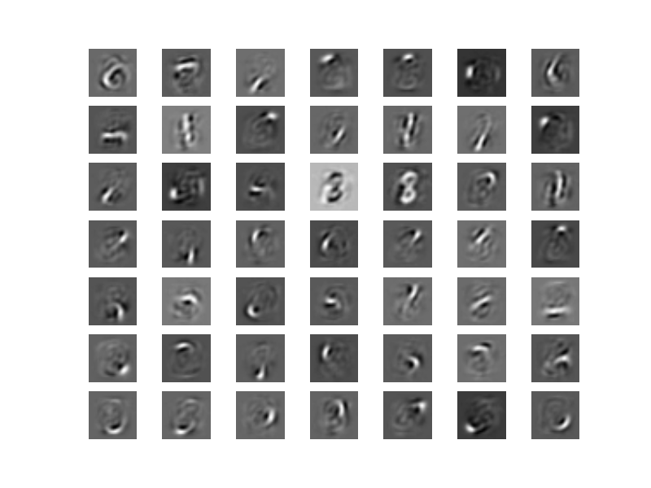
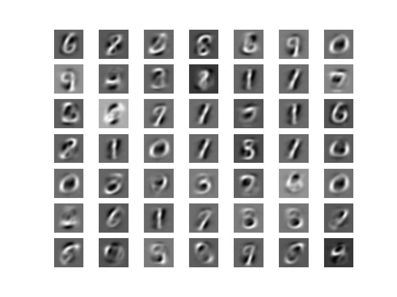

# autoencoder
Autoencoder and sparse autoencoder learning features of mnist dataset

Features learned using Autoencoder

Stroke features obtained by Sparse Autoencoder

Features of whole letter obtained by Sparse Autoencoder

